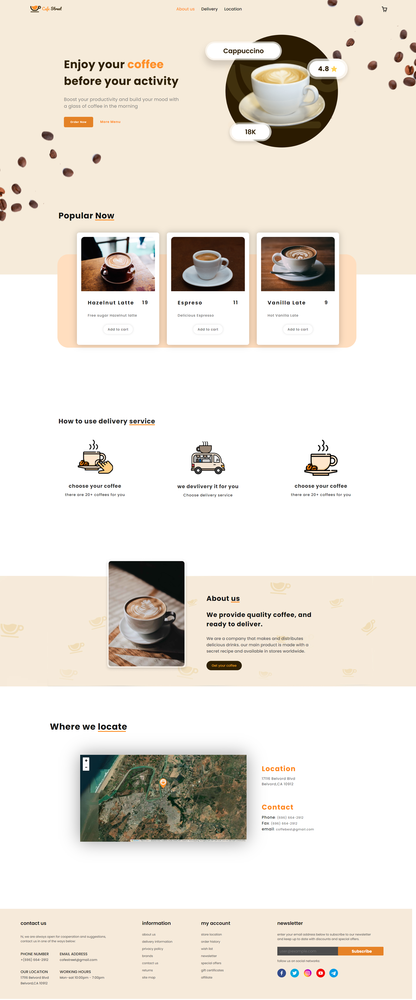

# coffe-street
This website is for a company called cofee street , i implemented some new features on Javascript:   
<ul> <li> The cart</li> <li> Smooth effect</li> <li> Mctore lcoation on the map </li>   <li>Responsiveness</li> <li>More</li> </ul>
  check the website to see all of them😉. https://coffee-street.netlify.app/ 
 
<h2> Its responsive for:</strong></h2>
<ul> <li> Mobiles</li> <li> Desktops</li> <li> Laptops</li> <li>all Devices</li> </ul>
  
<h2> what is used</h2>
<ul> <li> HTML</li> <li> CSS</li> <li> JAVASCRIPT</li> <li> PHOTSHOP</li>  <li> FIGMA</li> <li> Api </li> </ul>

